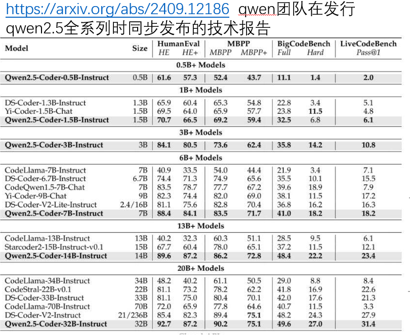

## 指标测试
本文件夹包括已完成的指标测试记录

## 指标参考

## 测试工具
evalscope平台,https://github.com/modelscope/evalscope

## 原始模型获取
modelscope平台,https://www.modelscope.cn/models
Qwen/Qwen2.5-0.5B-Instruct
Qwen/Qwen2.5-7B-Instruct
deepseek-ai/deepseek-coder-6.7b-instruct

## 微调模型获取
微调后的qwen-coder-0.5B和qwen-coder-7B已开源至modelscope社区, 链接如下:
sft-coder-0.5B: https://www.modelscope.cn/models/ferlin/sft-qwen-0.5B
sft-coder-7B: https://www.modelscope.cn/models/ferlin/sft-qwen-7B

## 指标选取
### HumanEval
定义：由 OpenAI 提出的代码生成评估基准，专注于 Python 单函数生成任务。
特点：包含 164 个手工编写的编程问题，每个问题有明确的函数签名、文档字符串（含示例）和隐藏测试用例，用于评估模型根据自然语言描述生成正确代码的能力。
评估方式：通过检查模型生成的代码是否能通过所有测试用例来判定正确性，常用 “pass@k” 指标（即从 k 个生成结果中至少有一个正确的概率）衡量性能。

### LiveCodeBench
定义：一个更贴近真实编程场景的代码生成评估基准，涵盖多语言（Python、Java、C++ 等）和复杂任务类型。
特点：包含更丰富的任务形式，如完整程序开发、bug 修复、代码补全、测试用例生成等，问题来源于真实项目和编程竞赛，更注重评估模型在实际开发中的综合能力。
评估方式：除了正确性检查，还关注代码效率、可读性、兼容性等实际开发中重要的指标，评估维度更全面。

## 测试指令

单卡测试指令:
evalscope eval \
 --model Qwen/Qwen2.5-0.5B-Instruct \
 --datasets xxx 

多卡测试or本地测试指令:
evalscope eval \
 --model path/to/your/local/model  \
 --model-args '{"revision": "master", "precision": "torch.float16", "device_map": "auto"}' \
 --datasets xxx
